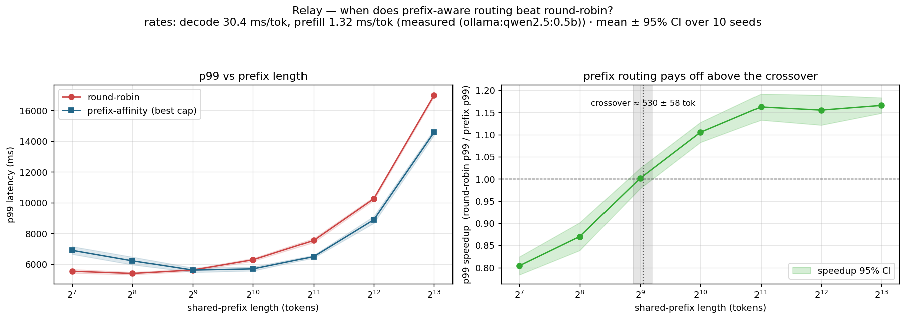
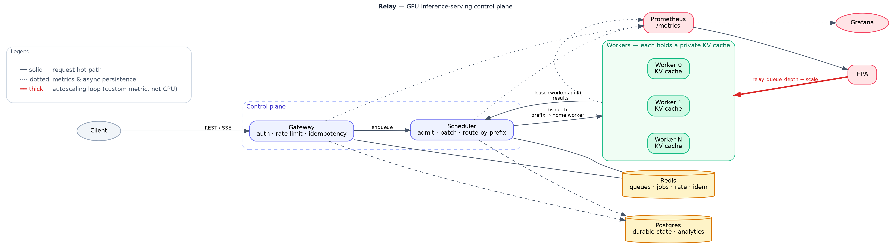

# Relay

A GPU inference-serving **control plane**: queue → schedule → batch → place → observe → autoscale. The lead feature is **prefix / KV-cache-aware routing under bounded load** — steering same-prefix requests to the worker that already holds their KV cache, balanced by **bounded-load consistent hashing** so a hot prefix can't pin one worker. One knob, `load_cap_factor`, sweeps the whole policy space from pure cache affinity to round-robin.

Design rationale, ADRs, and the decision records are in [`DESIGN.md`](DESIGN.md).

## Headline result: *when* does cache-aware routing beat load balancing?

Cache-aware routing is not free — it trades **load balance** for **saved prefill**. So the real question isn't "is it faster" but "under what conditions." Relay answers it with a measured number.

**Crossover ≈ 530 ± 58 shared-prefix tokens** (95% CI, 10/10 seeds crossed). Below it, decode dominates and plain round-robin wins; above it, prefill dominates and routing to the cached worker wins.

Per-token costs are **measured on real hardware** — an Apple M2 (8 GB) serving `qwen2.5:0.5b` via Ollama, read from llama.cpp's own timing fields: **decode 30.4 ms/token, prefill 1.3 ms/token** (decode is ~23× costlier per token, which is the fact the crossover hinges on). The routing itself is **simulated** (virtual-time discrete-event sim driving the real router); the rates are real, the routing is modeled, and that line is not blurred anywhere in this repo.



| shared-prefix tokens | prefill (ms) | round-robin p99 | best-prefix p99 | speedup (95% CI) | winner |
|---|---|---|---|---|---|
| 128 | 168 | 5539 ms | 6899 ms | **0.80 ± 0.02×** | round-robin |
| 256 | 337 | 5395 ms | 6217 ms | 0.87 ± 0.03× | round-robin |
| **512** | 674 | 5617 ms | 5614 ms | **1.00 ± 0.02×** | **crossover** |
| 1024 | 1348 | 6285 ms | 5691 ms | 1.11 ± 0.02× | prefix |
| 2048 | 2695 | 7539 ms | 6489 ms | 1.16 ± 0.03× | prefix |
| 4096 | 5390 | 10259 ms | 8891 ms | 1.16 ± 0.03× | prefix |
| 8192 | 10781 | 16981 ms | 14570 ms | 1.17 ± 0.02× | prefix |

- The **regimes are statistically real, not noise**: at 128 tokens the speedup CI sits entirely below 1.0 (round-robin genuinely wins); at 8192 it sits entirely above 1.0 (prefix genuinely wins). The error bars not straddling 1.0 are what license the claim that the technique *flips*.
- The crossover is the *derived* quantity, so it gets its own CI: interpolated per seed, then aggregated → **530 ± 58 tokens**, and it appeared in **every** replicate (10/10), so the crossover is a phenomenon, not a seed artifact.
- The **cost side is visible in the same run**: as prefix length grows, affinity buys cache hits (**0.82 → 0.95**) by spending load balance (**imbalance 1.15 → 2.07**), while round-robin stays flat at ~1.0. That trade *is* the mechanism.

The takeaway is the *condition*, not the number: KV-cache-aware routing earns its imbalance cost only once the shared prefix is long enough that prefill is the bottleneck — the RAG / shared-system-prompt regime. On short chat prompts it is a net loss, and a router should load-balance there. Reproduce: `PYTHONPATH=. python bench/crossover.py` (reads `bench/results/calibration.json`; `--seeds N`, `--output-tokens K`). Full data + CIs: [`bench/results/CROSSOVER.md`](bench/results/CROSSOVER.md).

## The mechanism

A consistent-hash ring with virtual nodes (`relay_core/hashing.py`) maps each prefix to an ordered worker preference list; adding/removing a worker remaps only O(K/N) keys, so an autoscale event doesn't cold-flush every cache. The router (`services/scheduler/router.py`) walks the ring from the prefix's position and takes the first worker under a load cap proportional to the live fleet average:

```python
cap = cap_factor * max(avg_load, 1.0)        # one knob; ∞ = pure affinity, →1 = round-robin
for wid in ring.walk(prefix_hash):           # affinity owner first, then spillover order
    if load(w) < cap and admit(w):
        return w
```

A structural bonus falls out for free: a hot prefix that overflows its owner always spills to the *same* ring successor, so the successor's cache warms too — bounded replication of hot prefixes, no extra code. Bounded-load consistent hashing is Google's published technique; the contribution here is applying it to KV-cache routing and measuring when it pays.

## Supporting result: the locality/balance Pareto frontier

Sweeping `load_cap_factor` over a **synthetic latency model** (30,000 requests, 4 workers, finite-Zipf s=1.1 over 256 shared prefixes) traces the full trade the crossover samples one slice of:

| policy | cap | cache-hit | p99 | load imbalance |
|---|---|---|---|---|
| round-robin | — | 69.3% | 1292 ms | 1.01× |
| bounded (knee) | 1.5 | 88.2% | 571 ms | 1.50× |
| pure affinity | ∞ | 95.1% | 433 ms | 2.08× |

Across the sweep, cache-hit climbs **69% → 95%** and p99 drops **~3×** (1292 → 433 ms) as routing shifts from balance to affinity, paid for in load imbalance (1.01× → 2.08×). The knee at `cap = 1.5` captures most of the latency win for far less imbalance — the practical operating point. This frontier uses the *synthetic* calibration (illustrative shape); the crossover above is the *measured-rate* result (the honest generalization). Regenerate with `make calibrate && make bench`. Full sweep + per-worker breakdown: [`bench/results/RESULTS.md`](bench/results/RESULTS.md).

## How the numbers were produced

- **A simulator that runs the real code.** `bench/simulate.py` imports the production router and deadline batch former *unchanged* and drives them over a virtual clock — open-system Poisson arrivals, warmup excluded, so p99 is meaningful and a 30k-request sweep finishes in seconds.
- **A workload that doesn't cheat.** Prefix routing does nothing on uncorrelated prompts. Traffic is a finite Zipfian pool of shared prefixes (exact inverse-CDF; reported skew is the real skew), with pool size, skew, and prefix/suffix lengths all disclosed.
- **Calibration from the engine's own mouth.** Per-token costs come from llama.cpp's `prompt_eval_duration` / `eval_duration` fields on the M2 — not a guess. The fixed per-request overhead `alpha` is a clean constant, *not* the noisy fitted intercept (which on an 8 GB box under load is mostly thrashing artifact); that choice is stated in the output.

## What went wrong (kept on purpose)

- **A reproducible null result.** The first topology formed batches globally then routed by the batch head's prefix → cache-hit identical across every policy, because a globally-formed batch mixes prefixes, so routing it only changes *which* worker pays the prefill, not *whether* it's paid. Fix: route per request at admission into per-worker queues, each worker batching its own queue — the topology SGLang's router and the vLLM Router use. Details in [`bench/results/RESULTS.md`](bench/results/RESULTS.md).
- **A calibration bug worth ~200×.** The first Ollama calibration faked "a batch of b" with b concurrent HTTP requests; on single-slot Ollama those serialize, and the fit misread queueing as a 1,710 ms per-item decode cost (53-minute p99s — an unstable queue, not a result). Fix: read the engine's real per-token timing fields and derive the constants, unit-tested against canned timings to R²=1.0.

## What runs where

Three honesty tiers:

**Runs now, locally, free (no GPU, no services):** the entire algorithmic core — consistent-hash ring, prefix router, radix prefix tree + longest-prefix router, deadline batch former, cache-aware + plain mock engines, Zipfian workload, calibration, and the sweeps that produce the results above — plus the full unit suite (96 tests).

```bash
make install        # core + bench deps (numpy, matplotlib, pandas)
make test           # 96 unit tests, ~1s
make bench          # Pareto sweep        → bench/results/{frontier.csv,png,RESULTS.md}
make calibrate      # fit latency constants (add --ollama for real hardware)
PYTHONPATH=. python bench/crossover.py        # seed-replicated crossover → crossover.{csv,png}, CROSSOVER.md
PYTHONPATH=. python bench/radix_compare.py    # longest-prefix vs single-hash routing → RADIX.md
```

**Written faithfully, needs external services (Redis, Postgres, gRPC):** gateway (FastAPI: `/v1/infer`, `/v1/jobs/{id}`, SSE stream, `/v1/models`, `/healthz`, `/readyz`, `/metrics`; Bearer auth; atomic Redis-Lua token-bucket; idempotency keys); scheduler (gRPC server, admission/backpressure, Redis-Streams queue with `XAUTOCLAIM` recovery, dispatch over worker lease streams); worker harness (pull-based gRPC leasing → backpressure) and the Ollama / Torch-MPS engines.

```bash
make compose-up     # redis + postgres + scheduler + gateway + 4 mock workers + prometheus + grafana
make helm-install   # deploy to a k3d cluster; workers autoscale on queue depth
make proto          # generate gRPC stubs (buf) into services/_gen before running services live
```

Heavy imports (FastAPI, redis, asyncpg, grpc, torch) are deferred behind graceful fallbacks, so every module imports without those packages — that is why `make test` runs anywhere.

**Real-GPU validation (rented 2× A40, done):** Relay's own router was run against **two real vLLM workers with separate KV caches**, reading vLLM's `cached_tokens` as ground truth. It confirms the *mechanism* — placement holds (1.00 vs 1.45–1.57 distinct workers/prefix), cache-hit climbs 0.74→0.96, and the p99 advantage grows with prefix length (1.13×→1.24×). Same `Engine` interface, so only the worker image changes. Full result + honest scope (what it does and doesn't confirm) in [`bench/results/VLLM_VALIDATION.md`](bench/results/VLLM_VALIDATION.md).

## Architecture

[](assets/relay_architecture@2x.png)

<sub>Edges: **solid** = synchronous request hot path · **dotted** = async persistence & metrics · **thick** = autoscaling control loop. Workers *pull* leased work (backpressure), and the scheduler routes each prefix to its home worker so that worker's KV cache is reused.</sub>

- **Routing depth**: `services/scheduler/router.py` + `relay_core/hashing.py` (single-hash) and `relay_core/radix.py` + `services/scheduler/radix_router.py` (longest-prefix).
- **Batching**: `services/scheduler/batch_former.py` (priority = a tighter latency budget; no-starvation dispatch trigger).
- **Autoscaling** on the custom `relay_queue_depth` metric (not CPU) via prometheus-adapter.
- **Metrics** named once in `relay_core/metrics.py`, instrumented from the start.

## Repo map

```
relay_core/         types, hashing ring, radix tree, queue, metrics  (shared, transport-agnostic core)
services/
  gateway/          FastAPI app, schemas, token-bucket limiter, Redis backplane
  scheduler/        router, radix router, batch former, admission, dispatch, Redis-Streams queue, gRPC server
  worker/           harness + engines/{mock, cache_aware_mock, ollama, torch_mps, vllm}
proto/relay/v1/     worker.proto (buf lint/breaking in CI)
bench/              workload, calibrate, simulate, run, crossover, radix_compare  →  results/
deploy/             compose/, postgres/, redis/, helm/relay/, k8s/ (HPA + prometheus-adapter)
dashboards/         relay.json (Grafana, keyed to the metric names)
tests/unit/         96 tests: ring, router, radix tree + router, former, engines, workload, limiter, admission
```

## Tests

```bash
make test           # PYTHONPATH=. python -m pytest tests/unit  →  96 passed
```

The suite pins the properties the result depends on: the ring's minimal-disruption guarantee, the router's affinity-vs-spill behaviour across the cap, the radix tree's longest-match and reference-counted LRU eviction, the former's no-starvation dispatch trigger, the cache engine's exact hit/miss latency law, and the workload's distribution and prefix-hash stability.

## Limitations

1. **The crossover is simulated; the routing is validated on real hardware.** The crossover/frontier numbers come from a virtual-time model (real M2 per-token rates, simulated routing). The routing layer itself has now been run against **two real vLLM workers with separate KV caches on 2× A40** ([`bench/results/VLLM_VALIDATION.md`](bench/results/VLLM_VALIDATION.md)): Relay's own `PrefixRouter` holds placement (1.00 vs 1.45–1.57 distinct workers/prefix), drives cache-hit 0.74→0.96 (vLLM's own `cached_tokens`), and its p99 advantage grows with prefix length (1.13×→1.24×) — confirming the *mechanism*. It does **not** confirm the crossover *location*: on the A40, affinity wins even at 128 tokens, so that hardware's crossover sits below the tested range, while the ~530-token figure is specific to the M2's ~23× decode/prefill ratio (different hardware → different economics → different crossover). Remaining future work is **scale** (2 workers / 0.5B model, not a throughput study) and the long-prefix tail (the 4096-token point hit a context/timeout limit).
2. **Cache eviction is modeled** (LRU at fixed capacity), not validated against a real engine under memory pressure — the long-prefix end of the crossover is most exposed to this.
3. **The batching model is linear** (`alpha + beta·b`); real continuous batching bends the curve and chunks prefill.
4. **The headline crossover uses single-prefix-hash routing, not longest-prefix (radix) matching.** Longest-prefix (radix) routing *is* implemented and tested separately ([`bench/results/RADIX.md`](bench/results/RADIX.md)) — a reference-counted radix tree plus `RadixPrefixRouter`, which on a broadly-shared-stem workload improves cache reuse (0.83→0.90) and load balance (imbalance 2.23→1.37) over first-block hashing. That comparison uses a block-level cost model, not measured hardware, and the radix router is not yet wired into the crossover sim; the main path still hashes character blocks rather than token blocks.

## Roadmap

Parked, in order: (1) characterize the crossover *surface* — sweep decode/prefill ratio and skew, and the cache-eviction-pressure regime the literature flags; (2) wire the now-implemented longest-prefix (radix) router into the crossover sim, and move from character-block to token-block hashing; (3) scale the vLLM validation past 2 workers / 0.5B and land the long-prefix (4096-token) point; (4) prefill/decode disaggregation — the measured 30.4-vs-1.3 ms/token split is exactly its motivation, and the vLLM Router already supports it.

## Where this sits

Bounded-load consistent hashing is published (Google); prefix-aware routing ships today in the vLLM Router, SGLang's router, Ray Serve's `PrefixCacheAffinityRouter`, and llm-d; DéjàVu and kvcached attack the adjacent KV-cache layers. The contribution here is not a new algorithm — it's a correct from-scratch implementation plus a rigorous measurement of *when the technique pays off*.