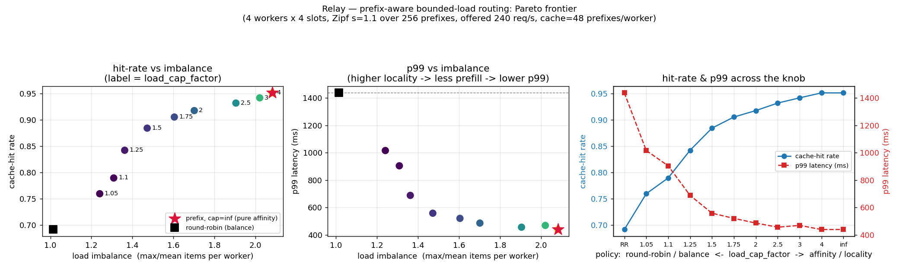

# Relay — routing benchmark results

*Generated by `bench/run.py` from the in-process virtual-time simulator (`bench/simulate.py`). These are real numbers produced on this machine, reproducibly, with no GPU.*

## Headline

Sweeping the router's single knob `load_cap_factor` from pure affinity (cap = inf) toward round-robin traces a clean Pareto frontier between **KV-cache locality** and **load balance**:

- **Cache-hit rate** rises from **69.1%** (round-robin) to **95.1%** (pure affinity).
- **p99 latency** falls from **1436 ms** (round-robin) to **440 ms** (pure affinity) — a **3.3x** reduction — because cache hits skip the 160 ms prefill.
- The **cost** is load imbalance: from **1.01x** (round-robin) to **2.08x** (pure affinity, where the hottest prefix pins its traffic to one worker).

### The knee (recommended operating point)

At **`load_cap_factor = 1.5`** the bounded-load policy captures most of the locality benefit for a modest imbalance cost:
- cache-hit **88.4%**, p99 **559 ms** (**2.6x** lower than round-robin), imbalance **1.47x** (**1.45x** the round-robin baseline).

## Full sweep

| policy | cap | hit | p50 | p95 | p99 | thrpt | imbal | batch | util |
|---|---|---|---|---|---|---|---|---|---|
| round_robin | — | 0.691 | 460 | 1113 | 1436 | 240 | 1.01 | 6.1 | 0.90 |
| prefix | 1.05 | 0.759 | 276 | 768 | 1016 | 240 | 1.24 | 4.8 | 0.75 |
| prefix | 1.1 | 0.789 | 243 | 646 | 905 | 241 | 1.31 | 4.6 | 0.68 |
| prefix | 1.25 | 0.842 | 194 | 492 | 689 | 241 | 1.36 | 4.3 | 0.56 |
| prefix | 1.5 | 0.884 | 113 | 428 | 559 | 241 | 1.47 | 4.2 | 0.46 |
| prefix | 1.75 | 0.905 | 106 | 376 | 521 | 241 | 1.60 | 4.2 | 0.41 |
| prefix | 2 | 0.918 | 103 | 351 | 487 | 241 | 1.70 | 4.2 | 0.38 |
| prefix | 2.5 | 0.932 | 101 | 323 | 457 | 241 | 1.91 | 4.2 | 0.35 |
| prefix | 3 | 0.942 | 100 | 314 | 470 | 241 | 2.02 | 4.3 | 0.32 |
| prefix | 4 | 0.951 | 99 | 311 | 440 | 241 | 2.08 | 4.3 | 0.30 |
| prefix | inf | 0.951 | 99 | 311 | 440 | 241 | 2.08 | 4.3 | 0.30 |

## Per-worker locality (why imbalance is the cost)

Round-robin spreads every prefix across all workers, so each worker's cache-hit rate is identical and item counts are flat. Pure affinity makes one worker the home of the hottest prefix: its hit-rate is high but it processes far more items.

| worker | round-robin hit | round-robin items | affinity hit | affinity items |
|---|---|---|---|---|
| w0 | 0.690 | 6840 | 0.970 | 4839 |
| w1 | 0.685 | 6583 | 0.967 | 14055 |
| w2 | 0.697 | 6798 | 0.897 | 4046 |
| w3 | 0.693 | 6779 | 0.928 | 4060 |

## Setup (for reproducibility)

- **Engine model:** CacheAwareMockEngine, latency `(alpha + beta*b + prefill*distinct_missed_prefixes) * jitter` with alpha=15.2 ms, beta=7.8 ms, prefill=160 ms, lognormal jitter sigma=0.15. alpha/beta provenance: calibration.json (source=synthetic).
- **Fleet:** 4 workers x 4 concurrent batches, max batch 16, cache capacity 48 distinct prefixes per worker.
- **Workload:** finite Zipf, s=1.1, pool=256 shared prefixes (800-char shared block + 48-char unique suffix); realized top-8 prefix mass = 51.9%.
- **Arrivals:** Poisson, offered 240 req/s; 30,000 requests, first 3,000 excluded from steady-state metrics (cold-cache warmup).
- **Scheduling:** deadline batch former, default budget 50 ms (DESIGN.md §8.1); routing per request at admission into per-worker queues (DESIGN.md §8.2).
- **Seeds:** workload=7, arrivals=11, engine=23. Every policy sees the identical request/arrival stream.

## Method note (a negative result worth keeping)

Routing *formed* batches by the prefix of the batch head — the literal composition of a single global §8.1 former with §8.2 — yields **no locality** (hit-rate identical across policies): a globally-formed batch mixes prefixes, so whichever worker takes it must prefill all of them. Locality only materializes when routing happens **per request at admission** into per-worker queues, so each worker batches its own prefix-coherent traffic. That is the topology measured here, and it is how production prefix-aware schedulers (SGLang, vLLM-router) are organized.
